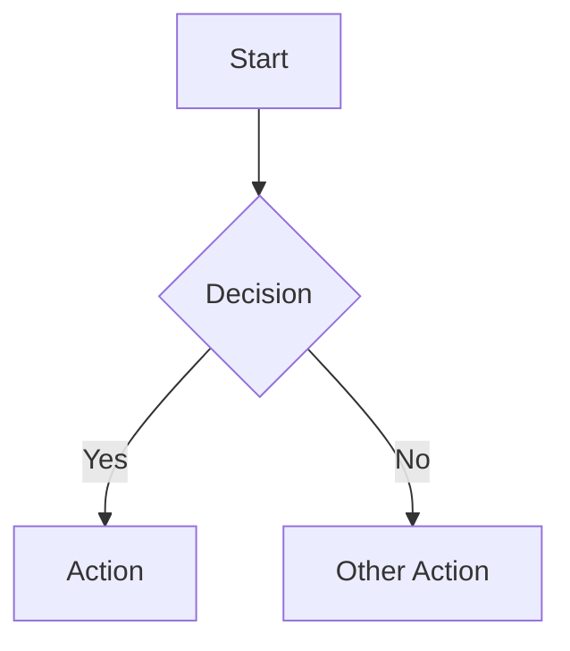

# viewmd User Guide

A fast, cross-platform desktop app for discovering and reading markdown files in repositories and project directories.

---

## Getting Started

### Opening a folder

Click **Add Folder** in the sidebar header (or use `Cmd/Ctrl+O`) to open a directory. Every markdown file inside it appears in a searchable tree. You can add multiple folders — each shows as a separate project section.

### Navigating files

- Click any file in the sidebar to preview it
- Use the **search bar** at the top of the sidebar to filter files by name
- Press **Enter** in the search bar to switch to content search (searches inside files)
- Click a folder to expand or collapse it
- **Drag and drop** files between directories to move them on disk
- **Right-click** or press **F2** on a file to rename it

### Tabs

Opening a file creates a tab. Click tabs to switch between files. Close tabs with the **x** button or `Cmd/Ctrl+W`. Your scroll position is remembered per tab.

---

## Reading & Preview

### Markdown rendering

viewmd renders CommonMark and GitHub Flavored Markdown with full support for:

- **Headings** (h1–h6, both ATX `#` and Setext `===`/`---` styles)
- **GFM tables** with header, alignment, and borders
- **Task lists** with checkboxes
- **Syntax-highlighted code blocks** — 16 languages: JavaScript, TypeScript, Python, Bash, JSON, CSS, HTML, XML, Markdown, YAML, SQL, Java, C#, Go, Rust, Diff, Plaintext
- **Mermaid diagrams** — fenced code blocks with ` ```mermaid ` render as SVG diagrams (flowcharts, sequence diagrams, state diagrams, etc.)
- **KaTeX math** — inline `$...$` and display `$$...$$` math expressions
- **Wiki-links** — `[[filename]]` or `[[filename|display text]]` links to other files in your project
- **Images** — relative paths resolve securely; images display inline

### Themes

17 built-in themes organised in four groups:

| Group | Themes |
|-------|--------|
| **Core** | System (auto light/dark), Light, Dark |
| **Reading** | Sepia, Sage (green, research-backed), Twilight Reader |
| **Colour** | Aurora, Prism, Solstice, Ember, Lagoon, Dusk |
| **Accessibility** | Stark Light, Stark Dark, Clarity, Terrain, Sapphire |

Quick-switch themes with **`Cmd/Ctrl+D`** or open **Settings** for the full list.

### Typography controls

- **Font size** — `Cmd/Ctrl++` to increase, `Cmd/Ctrl+-` to decrease, `Cmd/Ctrl+0` to reset. Range: 10px–32px. The toolbar shows the current size.
- **Font family** — choose from System Default, Humanist (Verdana), Geometric (Avenir), Classic Serif (Georgia), Modern Serif (Charter), or Monospace (SF Mono) in Settings.
- **Content width** — click the width icon in the toolbar to choose Narrow, Standard, Wide, or Full.
- **Line height** — Compact, Optimal, or Relaxed in Settings.

### Focus mode

Press **`Cmd/Ctrl+Shift+F`** to hide all chrome (sidebar, toolbar, outline) for distraction-free reading. Press **Escape** to exit.

### Warm filter

A subtle blue-light reduction filter for evening reading. Toggle in Settings.

### Reading progress

A thin progress bar at the top of the preview area shows your scroll position through the document. Hidden in collapsible view mode (where it would be misleading).

### Prose check

Click **Prose** in the toolbar to highlight style issues in your writing (passive voice, filler words, etc.). Highlights appear inline with tooltips explaining each issue.

### Custom CSS

Load a custom CSS file to style the preview area. Go to **Settings** and click **Load Custom CSS** to choose a `.css` file. Your custom styles apply on top of the active theme. Click **Clear Custom CSS** to remove them. The path is remembered across sessions.

### Sidebar text size

Click the **Aa** button in the sidebar header to choose Small, Medium, or Large text for the file tree. This is independent of the main font size control and also available in Settings.

### Copy & reveal

In the preview header:
- **Copy** — copies the raw markdown content to your clipboard
- **Reveal icon** (folder with arrow) — opens the file's location in Finder/Explorer

### Panel resizing

Both the **sidebar** and the **right panel** (outline/links) can be resized by dragging their inner border. Double-click the border to reset to the default width. The sidebar range is 180–500px; the right panel range is 160–400px. You can also use arrow keys when the resize handle is focused.

---

## Collapsible Document View

An opt-in mode that transforms the preview into an interactive heading tree — perfect for navigating large documents.

### Enabling collapsible mode

Click the **collapsible view icon** in the toolbar (two chevrons with lines, between Prose and Contents). The icon highlights when active (colour depends on your theme). Click again to return to standard preview.

### How it works

- **All headings are always visible** as a skeleton of the document structure
- **Only prose content collapses** — child headings stay visible even when their parent is collapsed
- **Default state**: all sections collapsed, showing the complete document outline
- **Left-border spine** — coloured borders on the left edge fade by heading depth for instant hierarchy recognition
- **Line count badges** — hover over any heading to see how many lines of content it contains

### Expanding and collapsing

- **Click** any heading to expand/collapse its prose content
- **Expand All** / **Collapse All** buttons at the top for batch operations
- Expanding a parent does NOT auto-expand its children
- The expanded heading row gets a subtle background tint to show which section is open

### Keyboard navigation

| Key | Action |
|-----|--------|
| `j` or `Down` | Move focus to next heading |
| `k` or `Up` | Move focus to previous heading |
| `Enter` or `Space` | Toggle expand/collapse |
| `Escape` | Collapse focused section |
| `[` | Collapse all sections |
| `]` | Expand all sections |

The first heading is tabbable by default — press **Tab** to enter the heading tree, then use the shortcuts above.

### Search in collapsible mode

Press **`Cmd/Ctrl+F`** — all sections automatically expand so native browser find can search the full document. Press **Escape** to restore your previous fold state. A subtle indicator shows when sections are expanded for search.

### Fold state persistence

Your expanded/collapsed state is saved per document and restored when you return to it. Fold state persists across app restarts. Up to 300 documents are remembered (oldest evicted via LRU). If you edit a document and headings change, your fold state transfers to the new heading IDs automatically.

---

## Document Outline & Links Panel

The right-side panel provides two views via a **segmented control** in the header: **Contents** and **Links**.

### Contents (outline)

Shows all headings in the current document as a clickable outline. The active heading (based on scroll position) is highlighted. Click any heading to scroll to it. Indentation shows heading depth.

Toggle the panel with **`Cmd/Ctrl+Shift+O`** or the Contents icon in the toolbar. When hidden, a narrow rail button appears on the right edge — click to re-open.

### Links

Shows the link relationships for the current document:

- **Outgoing** — files this document links to (via `[text](path)` or `[[wiki-link]]`)
- **Incoming** — files that link back to this document

Each link item shows the filename and parent directory. Click to navigate to that file. Counts shown in section headers.

### Broken and stale links

- **Broken links** (target file missing) — shown dimmed with strikethrough, not clickable
- **Stale links** (target modified since you last viewed it) — shown with an orange dot indicator

### Connected files filter

In the Links panel, click **"Filter to linked files"** to filter the sidebar file tree to show only documents connected to the current file. A dismissible pill appears in the sidebar with a **hop depth selector** (1-hop = direct links, 2-hop = links of links). Click the **x** on the pill to clear the filter.

---

## Editing

### Edit mode

Press **`Cmd/Ctrl+E`** to toggle between preview and edit mode. In edit mode, a raw markdown textarea replaces the preview. The document outline stays in sync with your edits.

### Saving

Press **`Cmd/Ctrl+S`** to save. A **dirty indicator** (dot) appears next to the filename when there are unsaved changes. If you switch files with unsaved changes, a dialog asks whether to save or discard.

### Tab key in editor

Tab inserts 2 spaces (not a tab character). Shift+Tab outdents.

---

## Exporting

### HTML export

Click **HTML** in the preview header. The exported file includes all styles, embedded images (as base64), and preserves the current theme.

### PDF export

Click **PDF** in the preview header. Uses the system print dialog with optimised print styles (no chrome, clean background, proper page breaks).

### DOCX export

Click **DOCX** in the preview header. Produces a Word document with embedded images and basic formatting.

All exports work from both standard and edit mode. In edit mode, the current draft content is exported.

---

## Mermaid Diagrams

viewmd renders mermaid diagrams from fenced code blocks:

````markdown

````

Supported diagram types include flowcharts, sequence diagrams, state diagrams, class diagrams, Gantt charts, pie charts, and more. Diagrams render as SVGs.

In collapsible mode, mermaid diagrams inside collapsed sections render correctly when the section is expanded.

---

## KaTeX Math

Inline math with single dollar signs: `$E = mc^2$`

Display math with double dollar signs:

```markdown
$$
\int_{-\infty}^{\infty} e^{-x^2} dx = \sqrt{\pi}
$$
```

---

## Keyboard Shortcuts

| Shortcut | Action |
|----------|--------|
| `Cmd/Ctrl+O` | Open folder |
| `Cmd/Ctrl+B` | Toggle sidebar |
| `Cmd/Ctrl+D` | Quick switch theme |
| `Cmd/Ctrl+E` | Toggle edit mode |
| `Cmd/Ctrl+S` | Save file |
| `Cmd/Ctrl+F` | Search (sidebar in standard mode, native find in collapsible mode) |
| `Cmd/Ctrl+Shift+F` | Toggle focus mode |
| `Cmd/Ctrl+Shift+O` | Toggle document outline |
| `Cmd/Ctrl+P` | Print |
| `Cmd/Ctrl+W` | Close current tab |
| `Cmd/Ctrl++` | Increase font size |
| `Cmd/Ctrl+-` | Decrease font size |
| `Cmd/Ctrl+0` | Reset font size |
| `Cmd/Ctrl+,` | Open settings |
| `F2` | Rename selected file |

### Collapsible view shortcuts

| Key | Action |
|-----|--------|
| `j` / `Down` | Next heading |
| `k` / `Up` | Previous heading |
| `Enter` / `Space` | Toggle section |
| `Escape` | Collapse section (or restore search state) |
| `[` | Collapse all |
| `]` | Expand all |

---

## Known Limitations

- **Linux**: File watching uses `fs.watch` which doesn't support recursive watching on Linux. The link index and file tree only update on user-initiated actions (save, rename, open folder), not on external file changes.
- **Stale link detection**: The "last viewed" timestamp resets on app restart. Links modified while the app was closed won't show as stale until you view them in the current session.
- **Headings in blockquotes/HTML**: Headings nested inside blockquotes, list items, or raw HTML blocks are treated as body content, not as separate collapsible sections. This is because the markdown parser treats them as inline content within their parent block.
- **Link index build time**: The initial link index builds asynchronously in batches on folder open, yielding to the event loop to avoid freezing the UI. For very large projects (1000+ files), the index may take a moment to complete. Subsequent updates are incremental.

---

## CLI Usage

```bash
# Open the app
viewmd

# Open a specific folder
viewmd ~/projects/my-repo

# Open a specific file
viewmd ~/projects/my-repo/README.md
```

File associations: double-clicking a `.md` or `.markdown` file in Finder/Explorer opens it in viewmd if registered as the default handler.
